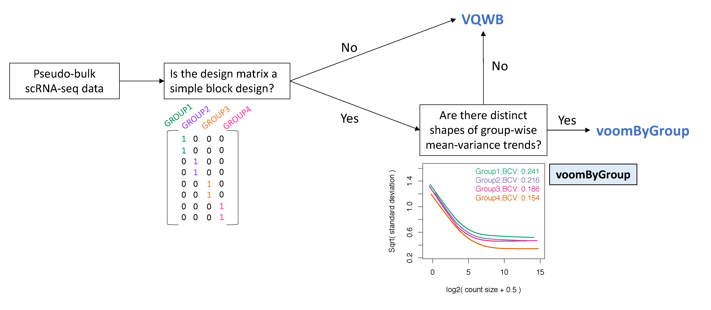

# voomByGroup
This github repository provides
- The source code of function [**voomByGroup**](https://github.com/YOU-k/voomByGroup/voomByGroup.R)
- [Help page](https://github.com/YOU-k/voomByGroup/example/Example_voomByGroup.html) about how to run DE analysis with **voom** and its derived methods (**voomWithQualityWeights** (with and without block), **voomByGroup**). Comparison between results obtained from them are included as well.
- [Scripts](https://github.com/YOU-k/voomByGroup/scripts) for simulations and analysis of COVID-19 patients data from our preprint: [Modeling group heteroscedasticity for pseudo-bulk samples in single-cell RNA-seq data](https://www.overleaf.com/project/623818bbca6c8f055c155faf).




## Codes to run voom and its derived methods
```
#voom
voom(y, design=design, ...) 

#voomQW with sample variability used
voomWithQualityWeights(y, design=design, ...)

#voomQW with block variability used
voomWithQualityWeights(y, design=design, var.group=group, ...)

#voomByGroup
voomByGroup(y, design=design, group=group, ...)
```
## USAGE of **voomByGroup**
```
voomByGroup(counts, design, group, ...)
#arguments:
  counts  a numeric matrix containing raw counts, or an ExpressionSet containing raw counts, or a DGEList object.
  group   a vector or factor indicating groups to have different variation to model group-wise variance.
  design  design matrix with rows corresponding to samples and columns to coefficients to be estimated. Defaults to the unit vector meaning that samples are treated as replicates.
  dynamic a vector of logical values indicating whether to use overall mean-variance to estimate variation for observations in a specific group
  plot  denotes to how to plot the mean-variance trends. Available options are:
        * "none": no plot 
        * "separate": individual mean-variance plots for each group
        * "combine": all mean-variance curves in a single plot
        * "all": individual mean-variance plots for each group, followed by a single plot with all mean-variance cuvres.
  ...       other arguments are passed to voom
```