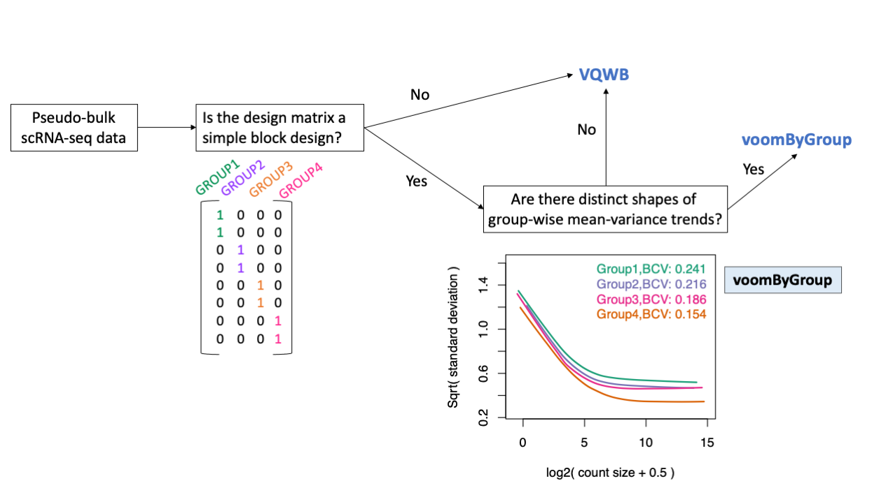

# voomByGroup
This github repository provides
- the source code of function [**voomByGroup**](https://github.com/YOU-k/voomByGroup/voomByGroup.R)
- [example script](https://github.com/YOU-k/voomByGroup/example/Example_voomByGroup.html) to run DE analysis with **voomByGroup**
- [scripts](https://github.com/YOU-k/voomByGroup/scripts) for simulations and analysis of COVID-19 patients data from our preprint: [Modeling group heteroscedasticity for pseudo-bulk samples in single-cell RNA-seq data](https://www.overleaf.com/project/623818bbca6c8f055c155faf).

